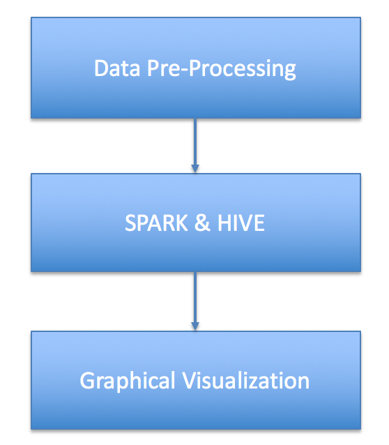
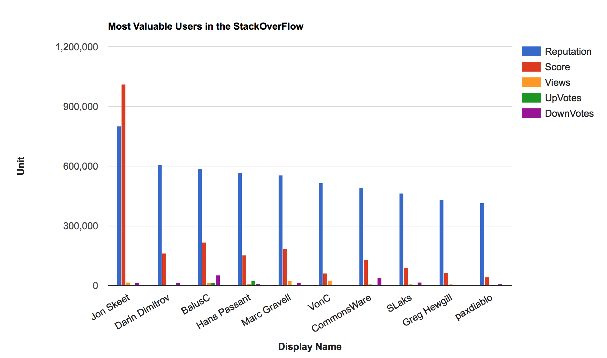
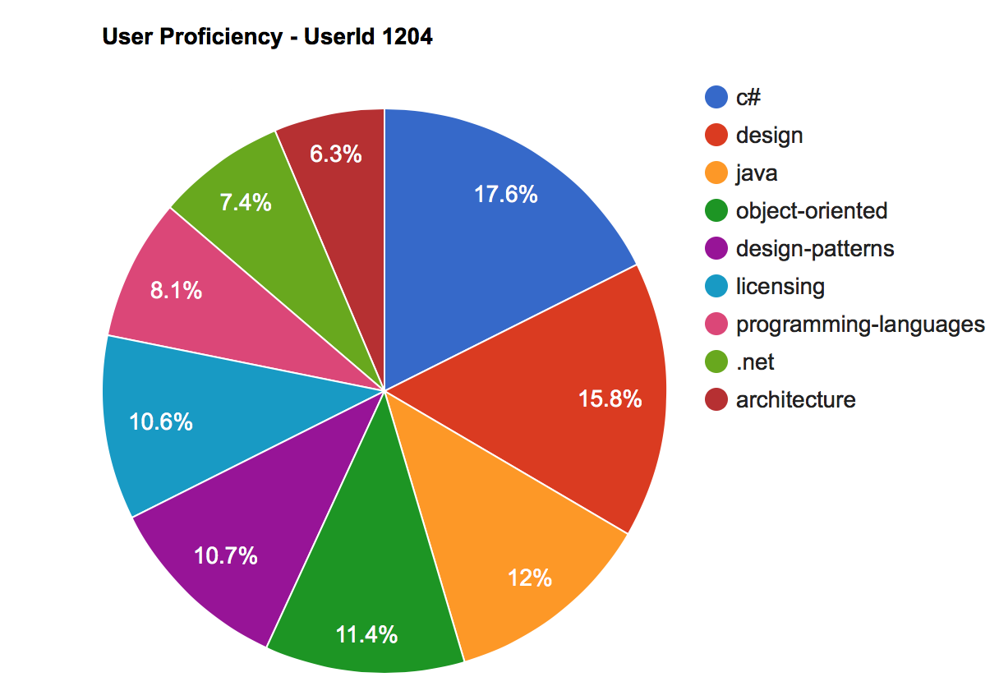
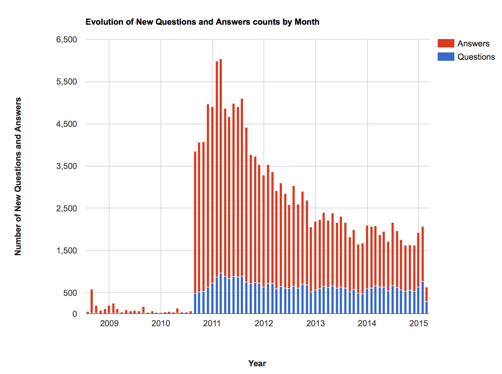

# stack-overflow-data-analytics

## Table of Contents
1. [Introduction](README.md#introduction)
2. [Data Source](README.md#data-source)
3. [Architecture](README.md#architecture)
4. [Analytics](README.md#analytics)
5. [Presentation](README.md#presentation)

## Introduction
[Back to Table of Contents](README.md#table-of-contents)

Performed data analytics on publicly released data of StackOverflow using big data techniques like spark1.3, pig and hive.

## Data Source
[Back to Table of Contents](README.md#table-of-contents)

link - https://archive.org/details/stackexchange

Data Format - XML

Data Size - 20GB

## Architecture
[Back to Table of Contents](README.md#table-of-contents)

## Analytics
[Back to Table of Contents](README.md#table-of-contents)

The following set of questions are analyzed on the data :
<ul>
<li>Most Valuable Users in the Stack Overflow </li>

<li>Top Developers in Java  </li>

<li>User proficiency </li>

<li>Evolution of Questions and Answers counts over Time  </li>

<li>Top 50 Tags, </li>

<li>Frequency Upvotes and Downvotes analysis for a post over Time</li>

<li>Users with High Reputation in the site</li>

<li>Number of new Users in each year</li>

<li>Distribution of Users over the world</li>

</ul>

Used Google Charts API for visualization of results.

## Presentation
[back to Table of Contents](README.md#table-of-contents)

[Slides](http://bit.ly/stackoverflowanalytics)
